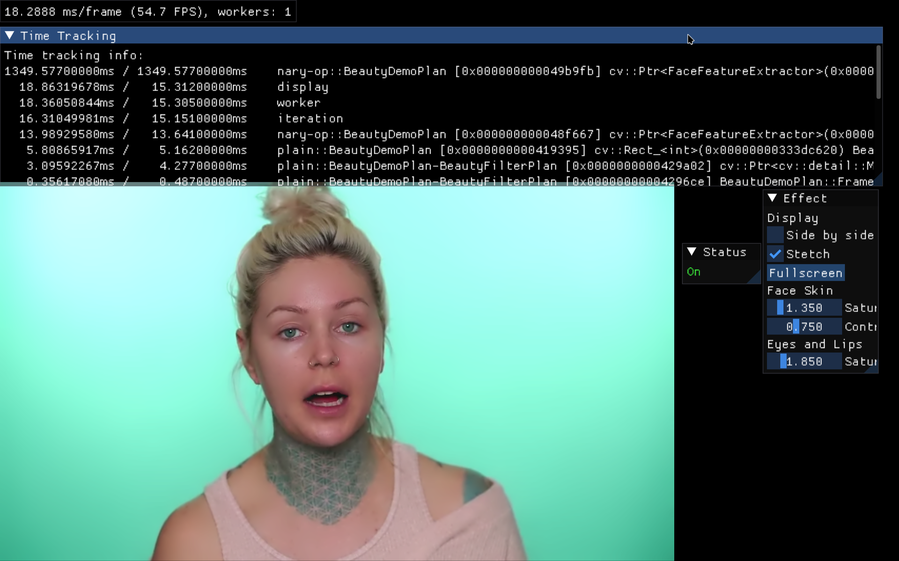
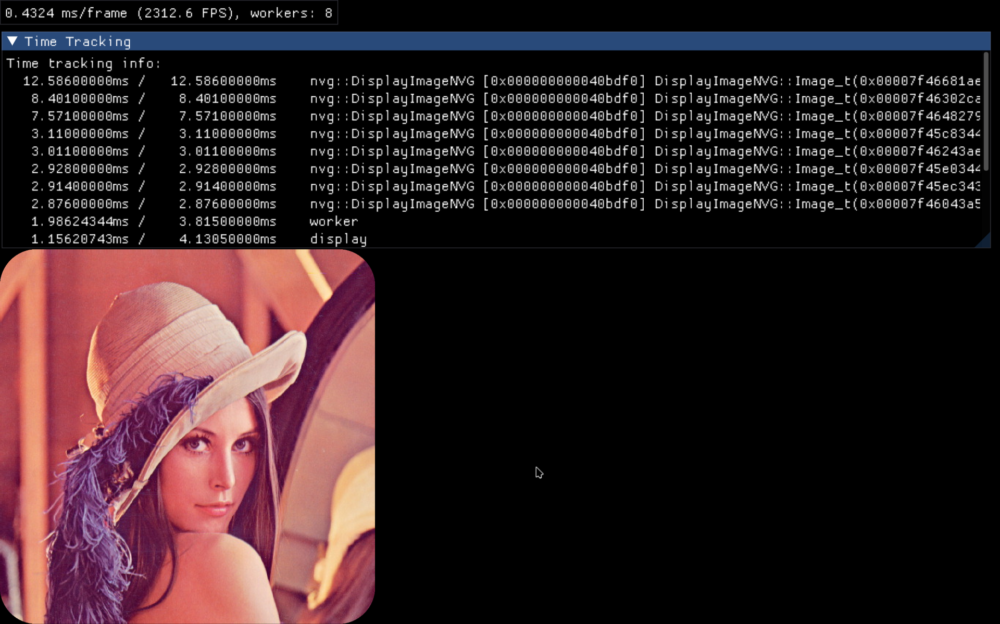

# Plan-DSL & V4D

Unofficial [OpenCV](https://opencv.org/) contrib modules for building per-frame
computation graphs that drive video, image, GPU, and GUI applications from a
single C++ class.

* **[plan](modules/plan/README.md)** — a **type-safe, dataflow-oriented C++ eDSL**
  (embedded domain-specific language). You describe one iteration of a frame
  loop; the compiler checks the graph at build time and the runtime replays it
  every frame. There is dynamic branching.
* **[v4d](modules/v4d/README.md)** — a **graphics runtime for Plan**: a
  GLFW/OpenGL window and event loop, NanoVG and ImGui rendering contexts, and
  video Sources/Sinks on top of the DSL.

Think *"GStreamer, but compile-time"*: the pipeline is written in C++, checked
by the compiler, and fixed at build time instead of being assembled and
negotiated at runtime.

 

## Three things to know

* **No frame loop.** Describe one iteration of the loop; the runtime records it
  once and replays it every frame. "Record once, replay forever."
* **Window, GPU and GUI included.** GLFW + OpenGL, NanoVG 2D vector graphics,
  ImGui immediate-mode UI, and bgfx — no boilerplate, no `while (true)`.
* **A normal OpenCV extra module.** Drop it into `OPENCV_EXTRA_MODULES_PATH`,
  build with C++20, and use it like any other contrib module.

## How it compares

Plan-DSL sits alongside a well-known family of graph-based media/vision
frameworks. The difference is *when* the graph is decided.

| Framework | Graph topology | Checking | Notes |
|---|---|---|---|
| GStreamer | built at runtime, plugins linked by name | runtime caps negotiation | playback/streaming graphs, `gst-launch` pipelines |
| NVIDIA DeepStream | built on GStreamer | runtime | inference-oriented plugin pipelines |
| OpenCV G-API | DAG built as C++ macros | runtime for untyped, typed wrapper partially checked | same project family; pipelines as expressions, backends |
| Halide | DSL-specific pipeline | compile-time | stencil/image-processing algorithm+schedule eDSL |
| DSPatch | runtime-wired objects | runtime, untyped | generic C++ dataflow/patching framework |
| TBB flow graph | runtime-wired nodes | runtime | dataflow graphs from function nodes |
| **Plan-DSL** | **recorded once, in C++** | **compile-time, type-safe** | task graphs with control flow, threading, GPU contexts |

Plan-DSL goes beyond a pure DAG:

* **Control flow is first-class.** `branch(pred)` / `elseBranch()` /
  `endBranch()` regions with parallel, single-time, and once-only semantics —
  not just a static DAG.
* **Shared memory is explicit and safe.** Edges declare access intent
  (`R`/`RW`/`RS`/`RWS`/`CS`), and `_shared(member)` layers a mutex on top.
* **The compiler is the checker.** Wrong operand types, dangling references,
  and invalid side-effect contexts fail to compile or fail at graph-build time —
  not ten minutes into a long encode.
* **Workers are per-thread graph copies.** Each worker records and replays its
  own independent copy of the graph, with deterministic in-order execution.

## Hello, graph

```cpp
#include <opencv2/v4d/v4d.hpp>
using namespace cv;
using namespace cv::v4d;

class FontRenderingPlan : public V4DPlan {
    string text_ = "Hello World";
    Property<cv::Size> size_ = P<cv::Size>(V4D::Keys::SIZE);
public:
    void infer() override {
        nvg([](const Size& sz, const string& str) {
            using namespace cv::v4d::nvg;
            clearScreen();
            fontSize(40.0f);
            fillColor(Scalar(255, 0, 0, 255));
            textAlign(NVG_ALIGN_CENTER | NVG_ALIGN_TOP);
            text(sz.width / 2.0, sz.height / 2.0, str.c_str(), str.c_str() + str.size());
        }, size_, R(text_));
    }
};

int main() {
    cv::Ptr<V4D> runtime = V4D::init(cv::Rect(0, 0, 960, 960), "Font Rendering",
                                     AllocateFlags::NANOVG);
    V4DPlan::run<FontRenderingPlan>(0);
}
```

No event loop, no GL calls, no cleanup code. `infer()` *records* the per-frame
graph; `V4DPlan::run<...>` boots the workers, drives the frame loop, and joins
when the window closes.

## The two modules

| Module | Description | Docs |
|---|---|---|
| `plan` | The type-safe dataflow eDSL: edges, operators, control flow, sub-plans, shared state. | [plan README](modules/plan/README.md) |
| `v4d` | The graphics runtime: window + GPU contexts, NanoVG/ImGui layers, Sources & Sinks. | [v4d README](modules/v4d/README.md) |

---

## Plan-DSL — the language

Four lifecycle methods on a class derived from `Plan`:

| Method       | When it runs                                        |
|--------------|-----------------------------------------------------|
| `setup()`    | once per worker thread, before the frame loop       |
| `infer()`    | once per worker thread — records the per-frame graph |
| `teardown()` | once per worker thread, after the frame loop        |
| `gui()`      | once, on the display thread, before the frame loop  |

Building blocks:

* **Edges** — the only value type. `V(x)`, `R(x)`, `RW(x)`, `RS(x)`, `RWS(x)`,
  `CS(x)`, `P<T>(key)`, `E<T>()` describe how a node accesses storage or runtime
  state.
* **Operators** — C++ operators that record nodes: `ADD`, `MUL`, `IF`, `IDX`,
  `DEREF`, … in symbol, named, or generic form.
* **Functions** — `F(callable, args...)` wraps any C++ callable as a node.
* **Control flow** — `branch(pred)` / `elseBranch()` / `endBranch()` regions
  with parallel, single, and once-only semantics.
* **Sub-plans** — compose large programs with `_sub<T>(...)` and `subInfer()`.
* **Shared state, properties, events** — mutex-protected members, typed runtime
  property edges, and input event streams.

Because execution is deferred, type errors, dangling references, and invalid
operand combinations surface at graph-build time — not hours into a recording
process.

## V4D — the runtime

A `V4DPlan` subclass gets a window, an event loop, and a set of side-effect
contexts on top of the DSL's `plain(...)`:

| Call               | Context        | Purpose                               |
|--------------------|----------------|---------------------------------------|
| `gl(fn, args...)`  | OpenGL         | Raw GL commands                       |
| `fb<pos>(fn, args...)` | Framebuffer | Direct framebuffer access             |
| `nvg(fn, args...)` | NanoVG         | Vector graphics on top of GL          |
| `bgfx(fn, args...)`| bgfx           | bgfx rendering (alternative to GL)    |
| `ext(fn, args...)` | External       | External renderer contexts            |
| `imgui(fn, args...)` | ImGui        | UI nodes from `gui()`                 |
| `set(key, edge)`   | CPU            | Runtime property write node           |
| `clear()`          | GL             | Clear to `V4D::Keys::CLEAR_COLOR`     |

### Sources and sinks are the runtime's job

When a source is configured, the runtime copies the frame into the framebuffer
**before** the plan's graph runs. When a sink is configured, the framebuffer is
handed to the sink **after** it runs. A plan therefore reads the frame with
`fb(...)` and writes the framebuffer with `fb(...)`, and never names the
`Source` or the `Sink`:

```cpp
void infer() override {
    fb(UMAT_COPY_TO_, RW(frames_.orig_));                 // read the frame
    plain(prepare_frames, R(downSize_), RW(frames_));     // process it
    fb<1>(cv::cvtColor, R(frames_.result_),               // write the framebuffer
          V(cv::COLOR_BGR2RGBA), V(0), V(cv::ALGO_HINT_DEFAULT));
}                                                        // sink writes it out
```

`capture()` and `write()` still exist on `V4DPlan` because they are how the
runtime emits those two nodes, but they are **runtime-internal**: they are
called for you by `Plan::run`, and a plan that calls them records a second copy
that both duplicates the work and races the automatic one.

Sources and sinks read from video files, webcams, or arbitrary functors, and
write to files or anything else:

```cpp
auto src  = Source::make(rt, "in.mp4");
auto sink = Sink::make(rt, "out.mkv", src->fps(), viewport.size());
rt->setSource(src);
rt->setSink(sink);
```

## Samples

Twenty-seven sample programs are registered as CMake targets in
[modules/v4d/samples/](modules/v4d/samples/) (plus two more behind
`OPENCV_V4D_ENABLE_BGFX=ON`):

| Start here | What it shows |
|---|---|
| `font_rendering.cpp` | the smallest visible program (32 lines) |
| `video_editing.cpp` | source → nvg → sink, the canonical pipeline |
| `beauty-demo.cpp` | the kitchen sink: shared state, sub-plans, `IF`, events, NanoVG, ImGui |
| `pedestrian-demo.cpp` | HOG/NMS detection, multi-pedestrian KCF tracking, and ImGui controls |
| `skeletal-tracker-demo.cpp` | MediaPipe pose: detector → per-person RoI → pose net, multi-person tracking |
| `imshow_reimplementation.cpp` | a full GUI image viewer |
| `image_carousel-demo.cpp` | a glossy animated image carousel |
| `shadertoy-editor.cpp` | an offline Shadertoy workbench with a GLSL editor and batch modes |

The full list, with a target name, a description, and the arguments each one
takes, is in the [V4D module README](modules/v4d/README.md#samples).

## Requirements

* C++20 (`<barrier>` and `<semaphore>`)
* OpenCV 5.x (core + imgproc; V4D additionally uses videoio, video, imgcodecs,
  ximgproc, dnn, geometry, face, objdetect, xobjdetect, tracking, optflow,
  plot, features, flann and stitching)
* The X11 (and, with `-DWITH_WAYLAND=ON`, Wayland) development files — GLFW
  itself is vendored, see [Third-party code](#third-party-code)
* An OpenGL-capable driver (or OpenGL ES 3.0)

### DNN on the GPU (OpenVINO / OpenCL) — read this first

OpenCV 5.x imports ONNX/TF/Caffe into its own graph engine, and that engine
**refuses every backend except OpenCV and CUDA**. On such a net both
`setPreferableBackend()` and `setPreferableTarget()` are no-ops that only log:

```text
Back-ends are not supported by the new graph engine for now
Targets are not supported by the new graph engine for now
```

Nothing throws, so the net silently runs on CPU. This affects
`DNN_BACKEND_INFERENCE_ENGINE`, `DNN_TARGET_OPENCL`, **and** `DNN_TARGET_VULKAN`
— including `OpenCV`'s own `ocl4dnn` engine. Do not trust a "successful"
`forward()` as evidence of GPU placement; compare timings with
`cv::ocl::setUseOpenCL(false)` or check `Net::dump()` for a `main_graph`.

The OpenVINO OpenCL GPU device *is* built in and does work — it is just only
reachable for models given to OpenCV as OpenVINO IR:

```cpp
cv::dnn::Net net = cv::dnn::Net::readFromModelOptimizer("m.xml", "m.bin");
net.setPreferableTarget(cv::dnn::DNN_TARGET_OPENCL);   // or OPENCL_FP16
```

`DNN_TARGET_OPENCL` maps to OpenVINO's `GPU` device, so this needs
`libopenvino_intel_gpu_plugin.so` next to the linked `libopenvino.so`
(`<libdir>/openvino-<version>/`), plus an Intel OpenCL ICD
(`intel-opencl-icd`) for the GPU itself. Set `OPENCV_DNN_IE_GPU_CACHE_DIR` to
cache the compiled OpenCL kernels.

`./build.sh` selects the DNN backend with `-d/--dnn-backend`; see its `--help`
for what that does and does not buy you on 5.x.

## Building

Both modules build as standard OpenCV extra modules. Use the helper script
below, or add them to an existing OpenCV build via `OPENCV_EXTRA_MODULES_PATH`
(pass `-DBUILD_EXAMPLES=ON` to also build the programs in
`modules/v4d/samples/`).

[`./build.sh`](build.sh) takes a command, then options:

| Command                   | What it does                                          |
|---------------------------|-------------------------------------------------------|
| `plan`                    | Configure, build and run the plan tests (the default) |
| `plan+v4d`                | Configure, build and install the plan+v4d stack (`v4d` is a shorthand) |
| `android`                 | Cross-compile the V4D demos for Android               |
| `configure`               | Configure the build directory, nothing else           |
| `build`                   | Compile an already-configured build directory         |
| `test`                    | Run the plan test and perf binaries                   |
| `install`                 | Install a built tree (`sudo make install`)            |
| `clean`                   | Remove the build directory                            |

`./build.sh --help` is the authoritative list. The options are `-t/--target`,
`-b/--build-type`, `-j/--jobs`, `-d/--dnn-backend`, `-r/--rebuild` and
`-h/--help`, plus `--abi`, `--api-level`, `--demo`, `--apk` and
`--configure-only` for the `android` command. Arguments after `--` are passed to
the test binaries:

```bash
./build.sh plan -b release -- --gtest_filter=Plan.*
```

### Plan-DSL

```bash
./build.sh plan -b debug
```

### Plan-V4D

```bash
./build.sh plan+v4d -b debug
```

| CMake option                    | Effect                                       |
|---------------------------------|----------------------------------------------|
| `OPENCV_V4D_ENABLE_ES3`         | Build against OpenGL ES 3.0 instead of desktop GL. |
| `OPENCV_V4D_ENABLE_BGFX`        | Build the bgfx context and link bgfx.        |
| `OPENCV_V4D_ENABLE_MALI`        | Mali GPU support (requires libmali).         |
| `OPENCV_V4D_USE_SYSTEM_GLFW`    | Link the system GLFW instead of the vendored `third/glfw`. |
| `OPENCV_V4D_SAMPLES`            | Android only: which samples to build as shared objects. |
| `BUILD_EXAMPLES`                | Build the programs in `modules/v4d/samples/`. |

Note that a locally built Release library is compiled with `-march=native`, so
it is pinned to the build machine's CPU. Rebuild for the target host rather
than shipping such a binary.

Run the Plan-DSL test suite (92 accuracy tests, 37 perf tests) with:

```bash
./build.sh plan
```

### macOS

* Requires macOS 13+, Xcode 14+ (Apple Clang 14+ / libc++ 15+) — for C++20
  `<barrier>`/`<semaphore>` and for the vendored third-party code.
* Leave `OPENCV_V4D_ENABLE_ES3=OFF` — the ES3 path uses EGL, which is not
  available on macOS. V4D automatically uses a desktop GL 3.2 core profile with
  forward compatibility and loads system GL function pointers.
* The `macOS-ARM64` and `macOS-X64` jobs in
  [`.github/workflows/PR-5.x.yaml`](.github/workflows/PR-5.x.yaml) exercise the
  modules on macOS in CI.

### Third-party code

V4D vendors GLFW, NanoVG, ImGui, GLAD and friends under
[modules/v4d/third/](modules/v4d/third/); it may require
`git submodule update --init --recursive`. GLFW
([3.5.1](modules/v4d/third/glfw)) is built together with the module and
installed alongside `libnanovg.so`, so no GLFW package is required; pass
`-DOPENCV_V4D_USE_SYSTEM_GLFW=ON` to link a system GLFW instead. Assets such as
the YuNet face detector, the MediaPipe pose models and the Roboto/JetBrains
fonts ship in [modules/v4d/assets/](modules/v4d/assets/) and
[modules/v4d/samples/fonts/](modules/v4d/samples/fonts/).

## Documentation

* [OpenCV 5.x Overview](docs/OVERVIEW.md) — architecture, module map, build
  system, backends, and provenance of the vendored `opencv/` tree.
* [OpenCV Programmer's Reference](docs/programmers-reference.markdown) — the
  structural, contract-level reference for the modules in `opencv/`.
* [OpenCV Application Programmers Guide](docs/application-programmers-guide.markdown) —
  the task-driven workflows (I/O, calibration, stereo, DNN, …).
* [Plan-DSL Programming Guide](modules/plan/doc/plan-dsl-programming-guide.markdown) —
  a friendly tour through the language.
* [Plan-DSL Reference](modules/plan/doc/plan-dsl-reference.markdown) —
  the canonical edge-by-edge, operator-by-operator reference.
* [V4D Application Programming Guide](modules/v4d/doc/v4d-application-programming-guide.markdown) —
  the V4D tutorial, milestone by milestone.
* [Sample walkthroughs](modules/v4d/doc/samples/README.md) — annotated walkthroughs
  `00`–`20`, one per sample, with the full code inline.
* [V4D doxygen tutorials](modules/v4d/tutorials/) — the short stubs the OpenCV
  doc build renders. [Both sets are mapped here.](modules/v4d/doc/README.md)

## Packaging

The project ships Debian packaging (`plan-v4d.dsc`, `debian.rules`,
`debian.tar.gz`) and an OBS recipe ([`obs/plan-v4d.spec`](obs/plan-v4d.spec)).

## Installing the packages

The OBS recipes under [`obs/`](obs/) build binary packages for four targets. The
same runtime is shipped everywhere; only the package names differ:

| Target | Format | Packages |
|---|---|---|
| openSUSE Tumbleweed | RPM (x86_64) | `plan-v4d-libs`, `plan-v4d-devel`, `plan-v4d-data`, `plan-v4d-docs`, `plan-v4d-samples` |
| Fedora | RPM (x86_64) | `plan-v4d-libs`, `plan-v4d-devel`, `plan-v4d-data`, `plan-v4d-docs`, `plan-v4d-samples` |
| Ubuntu 24.04 | DEB (amd64 and aarch64) | `plan-v4d-libs`, `plan-v4d-dev`, `plan-v4d-data`, `plan-v4d-samples` |
| Raspberry Pi OS (Debian 12) | DEB (armv7l and aarch64) | `plan-v4d-libs`, `plan-v4d-dev`, `plan-v4d-data`, `plan-v4d-samples` |

What each package provides:

| Package | Contents |
|---|---|
| `plan-v4d-libs` | Shared libraries (`libopencv_*.so`, `libnanovg.so`, `libglfw.so`). |
| `plan-v4d-devel` / `plan-v4d-dev` | Headers (including the vendored `GLFW/` and `nanovg/`), pkgconfig and CMake config for building against the modules. |
| `plan-v4d-data` | Pre-trained models, cascade classifiers, fonts (`/usr/share/opencv4`). |
| `plan-v4d-docs` (RPM only) | Programming guides and module documentation. |
| `plan-v4d-samples` | `example_v4d_*` binaries plus sample sources. |

### From the OBS repository

Once the binaries are published, add the Open Build Service repo to your distro
and install by name, so updates arrive through the normal package manager. The
`download.opensuse.org` paths below contain the exact format that exists on the
server: `home:/<user>:/Plan-V4D:/<subproject>/<repo>`. Note that the DEB
repositories are signed and split per architecture.

**openSUSE Tumbleweed** (x86_64)

```bash
sudo zypper ar https://download.opensuse.org/repositories/home:/elchaschab:/Plan-V4D:/openSUSE_Tumbleweed/openSUSE_Tumbleweed/ plan-v4d 
sudo zypper refresh
sudo zypper install plan-v4d-libs plan-v4d-devel plan-v4d-data plan-v4d-docs plan-v4d-samples
```

**Fedora** (x86_64)

```bash
sudo dnf config-manager --add-repo https://download.opensuse.org/repositories/home:/elchaschab:/Plan-V4D:/Fedora/Fedora/home:elchaschab:Plan-V4D:Fedora.repo
sudo dnf install plan-v4d-libs plan-v4d-devel plan-v4d-data plan-v4d-docs plan-v4d-samples
```

**Ubuntu 24.04** (DEB) — pick the repo matching your architecture (`Ubuntu_24.04`
for amd64, `Ubuntu_24.04_arm64` for aarch64). The apt source must reference the
repo's signing key, fetched from its published `Release.key`; the same command
rewrites an existing unsigned `plan-v4d.list`.

*amd64:*

```bash
sudo mkdir -p /etc/apt/keyrings
curl -fsSL https://download.opensuse.org/repositories/home:/elchaschab:/Plan-V4D:/Ubuntu_24.04/Ubuntu_24.04/Release.key | sudo gpg --dearmor -o /etc/apt/keyrings/plan-v4d-archive-keyring.gpg;
echo "deb [signed-by=/etc/apt/keyrings/plan-v4d-archive-keyring.gpg] https://download.opensuse.org/repositories/home:/elchaschab:/Plan-V4D:/Ubuntu_24.04/Ubuntu_24.04/ " | sudo tee /etc/apt/sources.list.d/plan-v4d.list
sudo apt update
sudo apt install plan-v4d-libs plan-v4d-dev plan-v4d-data plan-v4d-samples
```

*aarch64:*

```bash
sudo mkdir -p /etc/apt/keyrings
curl -fsSL https://download.opensuse.org/repositories/home:/elchaschab:/Plan-V4D:/Ubuntu_24.04_arm64/Ubuntu_24.04/Release.key | sudo gpg --dearmor -o /etc/apt/keyrings/plan-v4d-archive-keyring.gpg
echo "deb [signed-by=/etc/apt/keyrings/plan-v4d-archive-keyring.gpg] https://download.opensuse.org/repositories/home:/elchaschab:/Plan-V4D:/Ubuntu_24.04_arm64/Ubuntu_24.04/ " | sudo tee /etc/apt/sources.list.d/plan-v4d.list
sudo apt update
sudo apt install plan-v4d-libs plan-v4d-dev plan-v4d-data plan-v4d-samples
```

**Raspberry Pi OS (Debian 12)** (DEB) — same pattern as Ubuntu, with the
`Raspbian_12` repo path in place of the `Ubuntu_24.04` one (arch-suffixed,
e.g. `Raspbian_12_arm64`, once its binaries are published).

*armv7l / arm64:*

```bash
sudo mkdir -p /etc/apt/keyrings
curl -fsSL https://download.opensuse.org/repositories/home:/elchaschab:/Plan-V4D:/Raspbian_12/Raspbian_12/Release.key | sudo gpg --dearmor -o /etc/apt/keyrings/plan-v4d-archive-keyring.gpg
echo "deb [signed-by=/etc/apt/keyrings/plan-v4d-archive-keyring.gpg] https://download.opensuse.org/repositories/home:/elchaschab:/Plan-V4D:/Raspbian_12/Raspbian_12/ " | sudo tee /etc/apt/sources.list.d/plan-v4d.list
sudo apt update
sudo apt install plan-v4d-libs plan-v4d-dev plan-v4d-data plan-v4d-samples
```

## Testing the packages

Before publishing, the OBS-built binaries can be smoke-tested in real VMs with
[`obs/qemu-test.sh`](obs/qemu-test.sh) (boots each target distro in QEMU,
installs the packages, and runs a link/ABI/GUI test suite — details in
[`obs/README.md`](obs/README.md)):

```bash
./obs/qemu-test.sh <target>    # tumbleweed | fedora | ubuntu | raspbian
./obs/qemu-test.sh all         # run all four sequentially
```

Base images are downloaded automatically on first run (into
`$QEMU_WORK_ROOT/images`, default `/tmp/opencode/qemu/images`); populate
`obs/results/<TARGET>` first by running `./osc-build.sh --results` **from inside
`obs/`**, so there are packages to install. The arm64 Raspbian target
additionally needs `qemu-system-aarch64` and a `QEMU_EFI.fd` firmware installed
on the host.

## License

Apache 2.0, like the rest of OpenCV — see [LICENSE](LICENSE). Vendored
third-party code under `modules/v4d/third/` is licensed under its own terms.

## Attribution
* By far the biggest thank you goes to: [Marius Kintel](https://github.com/kintel/)
* Second: [Mateusz Jablonski](https://github.com/JablonskiMateusz) (Intel)

* The author of the bunny video is the Blender Foundation ([Original video](https://upload.wikimedia.org/wikipedia/commons/transcoded/f/f3/Big_Buck_Bunny_first_23_seconds_1080p.ogv/Big_Buck_Bunny_first_23_seconds_1080p.ogv.1080p.vp9.webm)).
* The author of the dance video is GNI Dance Company ([Original video](https://www.youtube.com/watch?v=yg6LZtNeO_8)).
* The author of the video used in the beauty-demo video is Kristen Leanne ([Original video](https://www.youtube.com/watch?v=hUAT8Jm_dvw)).
* The author of cxxpool is Copyright (c) 2022 Christian Blume: ([LICENSE](https://github.com/bloomen/cxxpool/blob/master/LICENSE))
* The author of the roboto font family is Google Inc. ([LICENSE](https://github.com/googlefonts/roboto/blob/main/LICENSE))